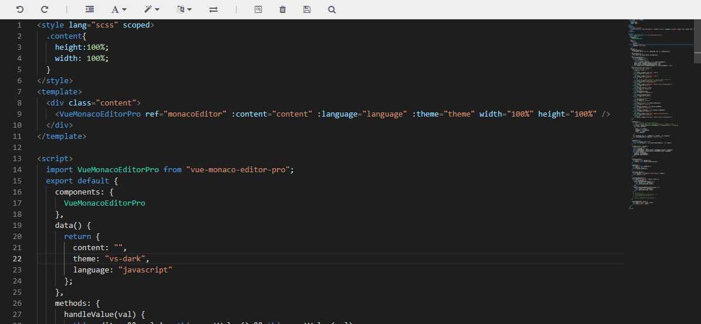

# vue-monaco-editor-pro

`vue-monaco-editor-pro` 是基于 `Monaco editor` 开发的简易版 `web` 端代码编辑器 `Vue` 组件。如在使用中若遇到问题可以提交 issues 。

## 预览图 


## 安装
```bash
npm install vue-monaco-editor-pro --save
```

## 快速使用

```html
<style lang="scss" scoped>
  .content{
    height:100%;
    width: 100%;
  }
</style>
<template>
  <div class="content">
    <VueMonacoEditorPro ref="monacoEditor" :content="content" :language="language" :theme="theme" width="100%" height="100%" />
  </div>
</template>

<script>
  import VueMonacoEditorPro from "vue-monaco-editor-pro"; 
  export default {
    components: {
      VueMonacoEditorPro
    },
    data() {
      return {
        content: "",
        theme: "vs-dark",
        language: "javascript"
      };
    }
  }
</script>
```
## 编辑器配置
在 `vue.config.js` 中添加如下代码，若没有则新建。（vue-cli3.0）
```js
const MonacoWebpackPlugin = require('monaco-editor-webpack-plugin')
module.exports = {
  chainWebpack: config => {
    config.plugin('monaco-editor').use(MonacoWebpackPlugin, [
      {
        
        languages: ['json', 'go', 'css', 'html', 'java', 'javascript', 'less', 'markdown', 'mysql', 'php', 'python', 'scss', 'shell', 'redis', 'sql', 'typescript', 'xml'],
        // 以下为全部支持的代码语言，可根据需求添加
        //   ['abap', 'apex', 'azcli', 'bat', 'cameligo', 'clojure', 'coffee', 'cpp', 'csharp', 'csp', 'css', 'dart', 'dockerfile', 'ecl', 'fsharp', 'go', 'graphql', 'handlebars', 'hcl', 'html', 'ini', 'java', 'javascript', 'json', 'julia', 'kotlin', 'less', 'lexon', 'lua', 'm3', 'markdown', 'mips', 'msdax', 'mysql', 'objective-c', 'pascal', 'pascaligo', 'perl', 'pgsql', 'php', 'postiats', 'powerquery', 'powershell', 'pug', 'python', 'r', 'razor', 'redis', 'redshift', 'restructuredtext', 'ruby', 'rust', 'sb', 'scala', 'scheme', 'scss', 'shell', 'solidity', 'sophia', 'sql', 'st', 'swift', 'systemverilog', 'tcl', 'twig', 'typescript', 'vb', 'xml', 'yaml'],

        features: ['format', 'find', 'contextmenu', 'gotoError', 'gotoLine', 'gotoSymbol', 'hover' , 'documentSymbols']
        // 以下为全部功能模块，可根据需求添加
        // ['accessibilityHelp', 'anchorSelect', 'bracketMatching', 'caretOperations', 'clipboard', 'codeAction', 'codelens', 'colorPicker', 'comment', 'contextmenu', 'coreCommands', 'cursorUndo', 'dnd', 'documentSymbols', 'find', 'folding', 'fontZoom', 'format', 'gotoError', 'gotoLine', 'gotoSymbol', 'hover', 'iPadShowKeyboard', 'inPlaceReplace', 'indentation', 'inlineHints', 'inspectTokens', 'linesOperations', 'linkedEditing', 'links', 'multicursor', 'parameterHints', 'quickCommand', 'quickHelp', 'quickOutline', 'referenceSearch', 'rename', 'smartSelect', 'snippets', 'suggest', 'toggleHighContrast', 'toggleTabFocusMode', 'transpose', 'unusualLineTerminators', 'viewportSemanticTokens', 'wordHighlighter', 'wordOperations', 'wordPartOperations']
      }
    ])
  }
}
```

## Props属性

| 属性值        | 类型          | 默认值                                                                                                                                                  | 描述                                                                                                                                    |
|:--------------|:--------------|:--------------------------------------------------------------------------------------------------------------------------------------------------------|:----------------------------------------------------------------------------------------------------------------------------------------|
| languageModal | Array         | ['json', 'go', 'css', 'html', 'java', 'javascript', 'less', 'markdown', 'mysql', 'php', 'python', 'scss', 'shell', 'redis', 'sql', 'typescript', 'xml'] | 代码语言模块                                                                                                                            |
| language      | String        | `javascript`                                                                                                                                            | 代码语言                                                                                                                                |
| height        | Number/String | `100%`                                                                                                                                                  | 编辑器高度                                                                                                                              |
| width         | Number/String | `100%`                                                                                                                                                  | 编辑器宽度                                                                                                                              |
| diffEditor    | Boolean       | false                                                                                                                                                   | 是否开启 diff 模式                                                                                                                      |
| original      | String        | null                                                                                                                                                    | diff 内容（只有在diff模式下有效）                                                                                                       |
| content       | String        | null                                                                                                                                                    | 内容                                                                                                                                    |
| theme         | String        | `vs-dark`                                                                                                                                               | 主题（hc-black、vs-dark、vs-light）                                                                                                     |
| options       | Object        | {}                                                                                                                                                      | 可查看：[Monaco Editor Options](https://microsoft.github.io/monaco-editor/api/interfaces/monaco.editor.ieditorconstructionoptions.html) |

## 方法属性
| 属性值          | 返回值         | 描述               |
|:----------------|:---------------|:-------------------|
| on-before-mount | monaco         | 编辑器挂载之前     |
| on-mounted      | editor, monaco | 编辑器挂载之后     |
| on-change       | value, event   | 内容改变后触发     |
| on-input        | value          | 内容改变后触发     |
| on-save         | value          | 保存点击按钮时触发 |